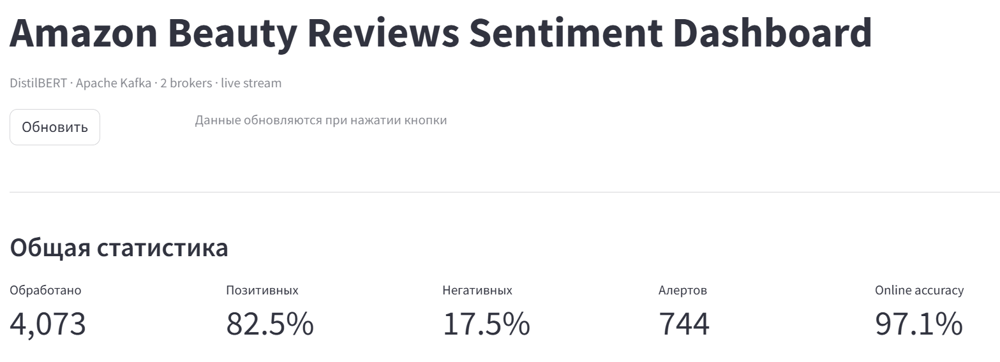
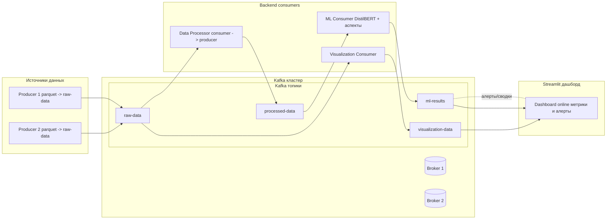
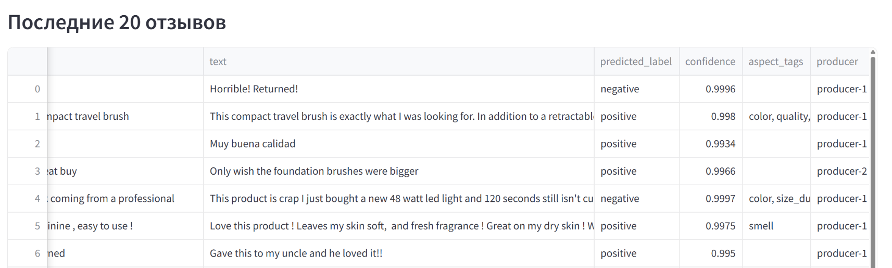
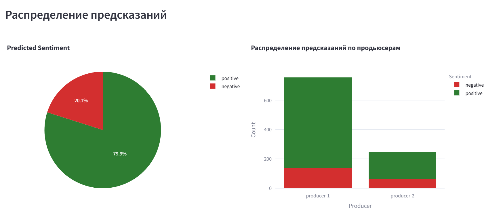
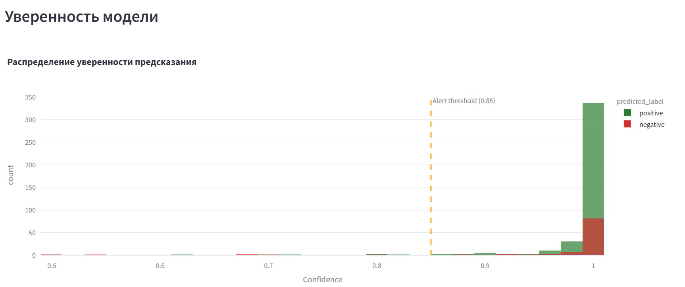
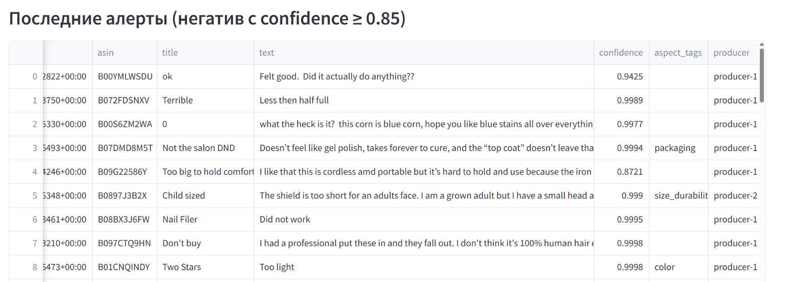
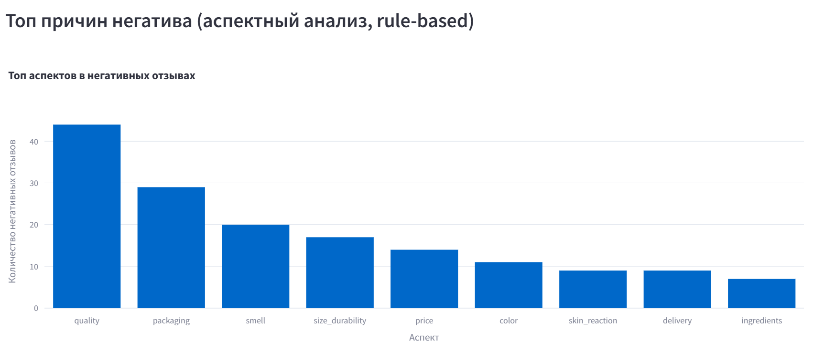
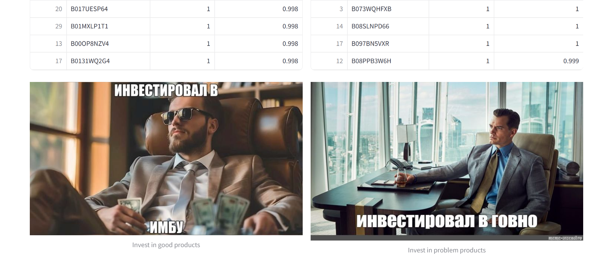

# Amazon Beauty Reviews Sentiment Analysis - Kafka lab

Проект реализует стриминговый пайплайн для анализа отзывов Amazon на базе датасета **Amazon Reviews’23** от McAuley Lab [`amazon-reviews-2023.github.io`](https://amazon-reviews-2023.github.io/).

В работе используется подмножество отзывов категории **All_Beauty**. Данный датасет насчитывает множество отзывов(почти 700к), что делает его хорошей площадкой для отработки качественной обработки текстов

**Основная цель**: оперативно определять и отслеживать негативные отзывы, так как именно они требуют быстрой реакции бизнеса. Простое усреднение рейтингов не отражает реальную картину: важно понимать, в чем конкретно проблема - неудобная упаковка, плохой запах, дефектная поставка или завышенная цена. Своевременное выявление очагов недовольства позволяет принимать меры до того, как они перерастут в репутационные риски



Проект демонстрирует end‑to‑end пайплайн: от чтения сырых отзывов, их препроцессинга и ML‑инференса до визуализации в реальном времени

Пайплайн выполняет тональный анализ отзывов, классифицируя их на позитивные и негативные в реальном времени

Дополнительно реализован аспектный анализ - он помогает уточнить, к каким аспектам относится негатив (например, "доставка", "качество", "запах"). Этот модуль носит вспомогательный характер: для него не обучалась отдельная ML-модель, а правила определяются по готовому rule-based словарю. Такой подход обеспечивает простую интерпретацию результатов и минимизирует вычислительные затраты

---

## Как запустить

### 1. Предварительные требования

- установлен Docker;
- порт `8501` свободен (используется Streamlit‑дашбордом);
- достаточно RAM/диска для запуска двух брокеров Kafka и модели DistilBERT

### 2. Старт

В корне репозитория `C:\amazon-reviews-kafka-lab` выполнить:

```bash
docker compose up -d --build
```

После успешного старта:

- открыть браузер и перейти на `http://localhost:8501` — здесь дашборд;
- для подгрузки новых данных из кафки - нажать кнопку "Обновить"

Остановка:

```bash
docker compose down -v 
```

---

## Архитектура проекта

Проект разделён на **backend** (Kafka producers/consumers, ML, конфиги) и **frontend** (Streamlit‑дашборд)

Kafka‑стек и приложения поднимаются через `docker-compose.yml`:

- **2 брокера Kafka** (`kafka-broker-1`, `kafka-broker-2`) в общей сети `kafka-net`;
- сервис `topic-init`, создающий топики с нужным replication factor и replica‑assignment;
- несколько **producers** и **consumers**, а также отдельный **ML‑consumer** на базе `Dockerfile.ml`;
- **Streamlit‑дашборд** `dashboard`, подключающийся к Kafka и отображающий online‑метрики



---

## ML / DL: идея и препроцессинг

- Для более глубокого анализа данных и обоснования выбранных порогов и настроек см. ноутбук `EDA_amazon_reviews.ipynb`.

ML‑часть реализована в `backend/consumers/ml_consumer.py`:

- используется модель **DistilBERT** (`distilbert-base-uncased`) с возможностью загрузки дообученных весов из `model/sentiment_distilbert/`;
- целевая задача - **бинарная классификация сентимента** (positive/negative) по тексту отзыва;
- ограничение длины отзыва `MAX_LENGTH=160` токенов - выбрано по результатам EDA, где оценивалось распределение длины и P95;
- дополнительно реализован **rule-based аспектный анализ** (delivery, packaging, smell, quality, price, color, ingredients, skin_reaction, size_durability) по ключевым словам (`ASPECT_PATTERNS`);
- для негативных отзывов с высокой уверенностью (confidence ≥ 0.85) помечаются **алерты**, чтобы бизнес мог быстро увидеть потенциальные проблемы

Препроцессинг и агрегации:

- `data_processor_consumer.py` обогащает сырые записи полями, удобными для модели и аналитики (нормализация текста, полей рейтинга, времени);
- `visualization_consumer.py` считает **rolling‑метрики** (скользящий средний рейтинг, долю негативных отзывов и т.п.) и пишет их в `visualization-data` для последующей визуализации

---

## Визуализация: Streamlit‑дашборд

Фронтенд в `frontend/app.py` реализован на **Streamlit**:

- подключается к Kafka (`BOOTSTRAP_SERVERS`) и читает:
  - `ml-results` — результаты ML‑инференса и аспектов;
  - `visualization-data` — подготовленные агрегации и rolling‑метрики;
- отображает:
  - **общую статистику**: количество обработанных отзывов, доля позитивных/негативных, число алертов, online accuracy модели;
  - **таблицу последних отзывов** (текст, предсказанный сентимент, уверенность, аспекты, producer);
  - **распределение предсказаний** (pie/bar по сентименту и продьюсерам);
  - **динамику среднего рейтинга и доли негатива** в скользящем окне;
  - **гистограмму уверенности модели** с порогом алерта (0.85);
  - **последние алерты** (негативные отзывы с высокой уверенностью);
  - **топ‑товары по сентименту** и **топ‑аспекты негатива**.








---

## Дополнительно

